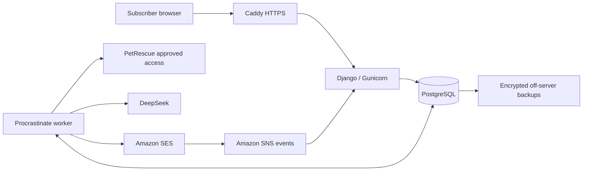

# Dog Finder design

Status: initial design for review, 20 September 2026. Product behaviour is defined in [USER_STORIES.md](USER_STORIES.md). This document selects an implementation; it does not claim the system is built or its capacity measured.

## Decisions and constraints

- Initially cap the service at 250 active email addresses, with up to five searches each (1,250 active searches). Retain 1,000 users / 5,000 searches as the longer-term architecture target.
- Keep a US$50/month operating target with an authorized US$100/month ceiling, before tax. Reserve some of it for domain renewal and incidental charges. Development and maintenance time are excluded.
- Operate one small Linux server. Prefer established components when they materially reduce implementation work.
- Use DeepSeek for direct assessment of free-text preferences. Preserve AI ranking and uncertain matches; do not build a preference language or rules engine initially.
- Plan the observation phase around an assumed upper scenario of 100 new dogs/day and 50% remaining eligible after location filtering. These are agreed planning assumptions, not measured source volume or a guaranteed upper bound.
- The architecture is intended to support 5,000 searches, but processing all of their matches within $50 is not established. The initial 250-user cap limits exposure while actual costs are observed; it does not guarantee the spending target. Raising that cap requires an operator decision informed by measurements.

## Stack

| Responsibility | Choice | Why |
|---|---|---|
| Application | Python 3.12, Django 5.2 LTS | Forms, validation, templates, migrations, security, and business logic in one application |
| Browser UI | Django templates, plain CSS, small amounts of JavaScript | The product is a handful of forms and management pages |
| Database | PostgreSQL 16, Django ORM, psycopg 3 | Reliable transactions and row locking for quotas, state changes, and workers |
| Background jobs | Procrastinate with its Django integration | Existing PostgreSQL-backed job queue with retries and task locks; no separate broker |
| HTTP and parsing | HTTPX, Beautiful Soup 4 | Fetch an approved feed/API or parse static listing pages |
| AI | DeepSeek API through HTTPX; Pydantic for response validation | One small provider adapter using the existing HTTP client |
| Email | Amazon SES v2 through boto3; Django email templates | Low variable cost and managed delivery |
| Serving | Caddy and Gunicorn | Automatic HTTPS and a conventional Python web server |
| Deployment | Ubuntu 24.04 LTS, uv lockfile, systemd services | One host, reproducible dependencies, automatic restarts |
| Backups | PostgreSQL dumps, restic, off-server object storage | Established backup tools and recoverable database snapshots |
| Verification | pytest, pytest-django, Ruff | Lifecycle, concurrency, matching, and integration checks |

Use current compatible security patches and lock dependencies. Django 5.2 receives extended support through April 2028. [Django support schedule](https://www.djangoproject.com/download/)

Procrastinate supplies queue mechanics and Django integration. Application tables still own search, match, and delivery state so retrying a job cannot recreate a logical operation. [Procrastinate documentation](https://procrastinate.readthedocs.io/en/stable/), [Django integration](https://procrastinate.readthedocs.io/en/stable/howto/django.html)

Start on a Lightsail instance in Sydney with 2 GB RAM and a public IPv4 address, currently US$12/month. Bound worker concurrency and database connections; validate memory usage before launch. This is a starting size, not a benchmark result. [Lightsail pricing](https://aws.amazon.com/lightsail/pricing/)

## Deployment shape

Web and worker processes run the same code release. PostgreSQL is reachable only locally. Start with two web workers and one job-worker process with bounded concurrency. Keep transactional email jobs responsive while matching runs. A small periodic coordinator finds due work and records it durably; unique run keys prevent duplicate daily runs.

There is no separate frontend deployment, Redis, vector database, container orchestrator, or managed database. Use ordinary Python modules for subscriptions, ingestion, matching, and delivery. Introduce another service only after a measured bottleneck warrants it.

## Data model

| Record | Purpose and important constraints |
|---|---|
| Subscriber | Email, verification state, address-wide credential version, suppression state; unique normalized address |
| Search | Name, postcode/state, interstate choice, description, lifecycle state, expiry, criteria revision, credential versions |
| Source run | Fetch outcome, completion time, publication sequence, counts, and error summary |
| Listing | Unique `(source, source_listing_id)`, current facts/text, content hash, availability, image and original URLs |
| Availability event | First observation or explicit return to availability, with source publication sequence |
| Search baseline | Per-source publication sequence and readiness for the current criteria revision |
| Candidate / assessment | Search revision, availability event, listing content version, verdict, score, reason, retry state |
| Email / email item | Frozen message intent, included listing identities, attempt state, provider ID, acceptance time |
| Sent listing | Unique `(search, listing)`; prevents repeat delivery even after an edit or availability change |
| Usage and suppression | Atomic spend reservations, token usage, rate-limit counters, and minimal blocked-address records |

Procrastinate owns its queue tables. Jobs contain record IDs, not email addresses, descriptions, or private links. Index pending work by status and due time; index candidates by search and revision. Do not materialize every search against the entire existing catalogue.

Keep timestamps in UTC and use `Australia/Sydney` for the schedule. Use database transactions for activation limits, confirmation consumption, criteria revisions, and cancellation. Address normalization must not merge provider-specific aliases such as Gmail dots or plus suffixes.

## Search and access lifecycle

Use Django signing with separate purposes for confirmation, single-search management, address-wide management, and unsubscribe. Include a random revocable credential version, not just a predictable database ID. Confirmation and recovery credentials expire and are consumed by an explicit action; management versions remain valid until revoked or their records are deleted. Recovery can rotate the management versions.

GET requests display pages only. Browser mutations require POST and CSRF protection. The native unsubscribe endpoint accepts the documented one-click POST with its separate credential and does not require a browser session. Private pages use `Cache-Control: no-store`, `Referrer-Policy: no-referrer`, and no third-party scripts. Redact credential-bearing paths from access/error logs.

Lock the subscriber when activating or renewing to enforce five active searches under concurrent requests. Apply the agreed 7-day confirmation window, 90-day term, 7-day reminder, and 30-day expiry grace period. Public submission/recovery responses do not disclose subscriber existence. Enforce the combined three-per-day confirmation/recovery limit and additional request-source limits in PostgreSQL.

Enforce the 250-user limit on distinct verified email addresses with at least one active, unexpired search. Pending confirmations and addresses with only cancelled/expired searches do not occupy a slot. Use a shared capacity-row lock and a consistent lock order when admitting a subscriber's first active search, including grace-period renewal, so simultaneous requests cannot exceed capacity. Existing active subscribers may add searches up to their five-search limit. Losing the last active search releases the slot; returning subscribers must obtain an available slot. At capacity, display a generic capacity message and allow management/cancellation to continue. Check capacity again at activation even if submission happened earlier; do not add a waitlist system initially.

Activation captures the latest successfully published source baseline without evaluating existing listings. Source publication and baseline capture must be serialized so a concurrent refresh has an unambiguous boundary. If no trustworthy snapshot exists, mark that source pending and use its first successful refresh as the baseline. Matching edits increment the criteria revision, clear pending candidates, and reset the baseline; renaming does neither. Sent-listing history survives edits and grace-period renewal.

## Daily pipeline

There are two different workloads. Ingestion fetches and parses each listing once for the entire service, reusing unchanged content. Matching judges a new eligible dog against individual search descriptions. PetRescue ingestion should use its permitted structured feed/API or a deterministic HTML parser; it does not need an LLM or browser agent by default. Actual daily listing volume may be low enough that both workloads are inexpensive. Establish that from observation rather than assuming the stress scenarios below are normal traffic.

1. Start ingestion around 6 am Sydney time using the permitted source access method. Fetch listings once for the whole service, with bounded concurrency and source-friendly request rates. Prefer a feed/API if offered. Do not fetch once per subscriber.
2. Validate the run before publishing it. A parser failure, suspiciously empty result, or incomplete pagination must not replace the last good snapshot. Store explicit availability changes; absence alone does not mean adopted or later relisted.
3. Select availability events newer than each search's baseline. Apply known state/interstate restrictions and adopted status in Python. Retain uncertain eligibility with a check note. Exclude already-sent identities.
4. Group remaining assessments and call DeepSeek within the daily spending allowance. Persist validated results and resumable progress. AI failures remain pending.
5. At 1 pm Sydney time, prepare each search's highest-ranked ready matches, up to 20, with confident matches before uncertain ones. Tie-break deterministically by score, event age, and identity. Preserve eligible overflow for later days.
6. Send queued messages, checking current search state, criteria revision, suppression, and listing status again. Do not send an empty match email. Retry failed assessments on later runs without changing their original eligibility.

1 pm means dispatch starts then, not simultaneous inbox delivery. Match work finishing after the daily selection cutoff waits until the following digest. Failed sources and delayed processing are visible on the website; partial processing must not be presented as complete coverage.

Use a licensed local postcode/state/centroid dataset. Calculate straight-line distances in Python, without a paid maps API. Ask for state where postcode mapping is ambiguous. Link to source-hosted photos only if permitted; do not copy an image catalogue by default.

## DeepSeek matching

Start with the documented `deepseek-flash` model, currently identified as DeepSeek-V4.1-Flash. Explicitly disable thinking for this classification task, bound output, and use JSON mode. Validate every result with Pydantic, including verdict, score, reason lengths, and exact membership of expected input IDs. Empty, truncated, or incomplete responses are failures, never implicit rejections. [Model documentation](https://api-docs.deepseek.com/quick_start/pricing/), [thinking control](https://api-docs.deepseek.com/guides/thinking_mode/), [JSON mode](https://api-docs.deepseek.com/guides/json_mode/)

Send one dog's relevant listing text with a small group of eligible search descriptions, initially up to 20. Give searches ephemeral request-local IDs. Ask for an independent `match`, `check`, or `reject` verdict and fit score for every description; request concise reasons/check notes for included dogs. Grouping saves repeated input tokens, but it must pass quality evaluation against individual assessments before production use.

Keep the original description and substantive listing text. Remove navigation and boilerplate, but do not silently truncate long descriptions or discard requirements to save tokens. Split oversized requests. Treat both listing text and subscriber text as data, with no tools or external actions available to the model.

Cache completed assessments by description, listing content hash, model configuration, and prompt version. Only exactly equivalent descriptions can share results. A stale in-flight result for an edited search cannot create candidates for its new revision. Keep unassessed eligible work pending across days; do not send unjudged dogs.

Do not transmit email, postcode, search name, management credentials, or interstate-choice fields. Free-text descriptions may still contain personal details. Confirm the API's applicable retention and processing terms and disclose the provider before launch. Do not assume the API has the same terms as a consumer chat product.

Complete ordinary matching during the early Sydney morning where practical. Current off-peak pricing aligns with that window, but retries may cross into peak hours. Spending reservations use peak, uncached rates; provider caching and off-peak execution are savings, not correctness dependencies.

## Email delivery

Use SES's à-la-carte plan, shared sending infrastructure, verified domain, and SPF/DKIM/DMARC configuration. Obtain production access and adequate quotas before launch. Use multipart HTML/text templates and application-owned per-search unsubscribe links. Do not enable engagement tracking.

SES is recommended here because the $50 target makes a $20 monthly email base fee significant. Its sending charge is currently $0.10 per 1,000 emails on à-la-carte pricing, plus applicable data/service charges. Retain SES under the $100 ceiling to leave more room for matching. [SES pricing](https://aws.amazon.com/ses/pricing/)

Write a durable email intent before calling SES. Tag each send with its internal intent ID and receive send, delivery, bounce, and complaint events through SNS. Authenticate notifications, allow only the configured topic, deduplicate events, and persist them before acknowledging. [SES event publishing](https://docs.aws.amazon.com/ses/latest/dg/monitor-using-event-publishing.html)

SES SendEmail does not expose a general idempotency key. Disable automatic blind retries of an ambiguous send. If the response is lost, mark the intent `acceptance_unknown`; a correlated send/delivery event can resolve it. Absence of an event does not prove failure: unresolved intents need operator investigation and must not be retried automatically. This is a deliberate operational cost of choosing SES. [SendEmail API](https://docs.aws.amazon.com/ses/latest/APIReference-V2/API_SendEmail.html)

Record sent-listing history only after known acceptance. Block overlapping messages from reusing items in an unresolved intent. Hard bounces and complaints suppress the entire address and cancel all its searches. Cancellation and send admission use the same per-address synchronization; cancellation cannot report completion while a send is being admitted. A request already in flight may still be accepted, which is a provider boundary to explain alongside the existing already-accepted-email caveat.

## Budget and affordable capacity

Planning envelope, USD per month, without introductory credits:

| Item | Target allocation | Ceiling allocation |
|---|---:|---:|
| 2 GB Lightsail host | $12 | $12 |
| Encrypted off-server backups | $2 allowance | $2 allowance |
| SES and email event handling | $5 allowance | $5 allowance |
| DeepSeek | $25 target | $75 ceiling |
| Domain renewal provision and contingency | $6 | $6 |
| Total | $50 target | $100 ceiling |

Backup, domain, and event costs are allowances, not vendor quotes. Source-access or postcode licensing fees are unknown and could change this budget. Monitor actual costs; use hard application limits for controllable usage and billing alerts for the remainder. Taxes are additional.

DeepSeek currently lists Flash at $0.15/million uncached input tokens and $0.60/million output tokens off-peak; peak prices are twice those amounts. The following estimates assume no provider cache hits. Prices were checked on 20 September 2026 and must be rechecked before launch. [DeepSeek pricing](https://api-docs.deepseek.com/quick_start/pricing/)

Illustrative grouped-assessment assumptions: 1,000 shared input tokens per dog/request, 20 descriptions per request, 80 input tokens per description, and 40 output tokens per result on average. This is 130 input plus 40 output tokens per pair, costing $0.0000435 off-peak. Actual prompts, match rates, group fill, retries, and listing lengths must be measured.

| Scenario | Active searches | New dogs/day | Fraction eligible after location filtering | Pairs/month (30 days) | AI cost, all off-peak |
|---|---:|---:|---:|---:|---:|
| Initial cap, one search per user | 250 | 100 | 50% | 375,000 | $16.31 |
| Initial cap, two searches per user | 500 | 100 | 50% | 750,000 | $32.63 |
| Initial cap, five searches per user | 1,250 | 100 | 50% | 1,875,000 | $81.56 |
| Light illustrative workload | 1,000 | 50 | 20% | 300,000 | $13.05 |
| Broader illustrative workload | 1,000 | 100 | 50% | 1,500,000 | $65.25 |
| Five searches per user, broader workload | 5,000 | 100 | 50% | 7,500,000 | $326.25 |

These are sensitivity checks, not forecasts or measurements of PetRescue. For example, 10 new dogs/day, 1,000 searches, and 20% location eligibility would produce 60,000 pairs/month and about $2.61 in off-peak AI cost under the same token assumptions. Under these assumptions, $25 buys about 575,000 pairs/month off-peak, or about 19,000/day. Peak execution halves that capacity. A larger output or poor group fill reduces it further.

At one daily email per search, 1,000 searches generate at most 30,000 monthly match emails ($3 in SES sending charges), whereas 5,000 generate 150,000 ($15), before service emails and other charges. The $5 email allowance therefore also depends on actual activity.

At the initial 250-user cap and five searches each, the planning scenario produces 62,500 assessments/day. AI is approximately $81.56/month off-peak; up to 37,500 match emails cost $3.75 in sending charges. Adding the $12 host, $2 backup allowance, and $6 domain/contingency allowance gives approximately **$105/month**, before tax and extra usage. With one search per user, the corresponding estimate is about **$37/month**; with two, about **$54/month**. Cost scales with actual active searches and listing volume, not registered users alone.

The $50 total is a soft target: alert when projected monthly spending exceeds it, but continue processing within the authorized $100 ceiling. Initially allocate up to $75/month to AI, reducing that allowance if other costs are projected to exceed their combined $25 allocation. Under the token assumptions above, $75 funds about 1.72 million off-peak assessments/month, or 57,000/day. The five-search scenario still slightly exceeds this capacity and the total ceiling, so it may defer work. Observe daily new listings, active searches per subscriber, location-filter survival, tokens/cost per assessment, email volume, and pending-work age during the initial rollout.

Reserve estimated maximum cost atomically before every AI call, including bounded retries; settle against returned token usage. Keep the reservation when usage is unknown. Pace spending across the month with a modest carry-forward allowance, and preserve a buffer for price/token-estimation error. Give pending searches a fair turn rather than letting a few broad searches monopolize the allowance.

Before admitting work that would exceed the AI allowance or projected $100 total, pause the affected discretionary work, preserve candidates, show delays, and alert the operator. Keep cancellation and management available. Billing alerts alone are not a hard provider cap; reserve fixed costs, committed/in-flight usage, and contingency before admitting new usage. Pause new activations when measured backlog or projected spending is unsustainable. Do not silently weaken matching, discard candidates, or claim that delaying an ever-growing backlog solves capacity. Pause intake rather than delete pending eligible work; let normal cancellation/expiry end it.

**Launch gate:** measure a representative week of permitted listings and representative search descriptions. Forecast the full workload, including five-search usage, retries, and peak spillover. Exceeding the $50 target triggers review, not an automatic stop. If the desired user population exceeds the $100 ceiling, increasing the ceiling or changing product/matching behaviour requires a further decision. Changing the model alone does not prove the budget is met.

## Operations, retention, and verification

Use systemd restart policies, automatic OS security updates, bounded logs, restricted SSH, and a firewall exposing only HTTP/HTTPS plus controlled administration. Store secrets outside the repository with restricted permissions. Keep operator access separate from subscriber capability links. Provide aggregate health through an authenticated operator page; do not register subscriber data for unrestricted browsing in the default admin.

Back up the database daily and before migrations, encrypt it off-server, and test restoration to a fresh host. Initially propose seven daily backups and a 24-hour recovery-point target. A restore must start with sending disabled: reconcile suppression, cancellation, and sent records against retained events before resuming, since a backup can predate those actions. Single-host recovery takes operator intervention; there is no automatic failover.

Use an external heartbeat check for missed daily runs, plus alerts for parser failures, old pending jobs, ambiguous sends, disk usage, and spend. The alert destination must be usable even when SES or the application is failing.

Proposed retention defaults for review: delete cancelled/fully expired search data within 24 hours; delete expired unconfirmed searches within 24 hours of their 7-day deadline; keep redacted operational logs for 14 days and backups for seven days. Preserve only keyed address hashes and reason/timestamp for suppression as long as necessary to block further sends. Purge descriptions from assessment caches, email payloads, and queue-related records as well as Search rows. Final privacy text must also cover provider retention.

Verification before public launch:

- Exercise all subscriber journeys, credential scopes, scanner-safe links, concurrent activation limits, and native unsubscribe.
- Test first baselines, failed refreshes, relisting, edits during matching, overflow, expiry, and renewal with deterministic fixtures.
- Evaluate grouped DeepSeek outputs against human-labelled examples, including missing facts, explicit conflicts, unusual preferences, and malicious text. Measure false exclusions and token cost, not just JSON validity.
- Inject worker crashes, duplicate provider events, send timeouts, and cancellation during dispatch; verify that ambiguous acceptance never causes a blind resend.
- Load-test 5,000 search records and a synthetic daily pipeline using mocked provider calls on the intended host. Separately measure real provider throughput and costs on a small permitted sample.
- Restore a backup, inspect mobile/text email rendering, and confirm source permission, postcode licensing, provider terms, sending quotas, sender identity, and domain setup.

## Implementation order

1. Validate source access and run the small matching quality/cost experiment. This establishes affordable capacity before investing in the whole product.
2. Build Django/PostgreSQL subscriber flows, credentials, and transactional service email.
3. Add shared ingestion, versioned baselines, DeepSeek assessment jobs, and daily digests.
4. Add suppression events, spend controls, retention, backups, and operational checks; validate before opening public registration.

Do not add a structured preference engine, embeddings, self-hosted model, or distributed infrastructure initially. If measurements require a change, optimize the measured dominant cost first. Preserve the personal pipeline until the replacement is validated; this design does not authorize retiring it yet.

## Later shelter expansion

Keep a small source adapter boundary: each adapter returns the same listing identity, facts, text, URLs, and availability fields. The initial implementation has one PetRescue adapter. Additional shelters can reuse matching, delivery, and subscriber logic without changing their contracts.

Some future sources may need browser rendering or AI-assisted extraction. Playwright supplies browser automation; it does not itself require an LLM. Prefer deterministic extraction from a rendered page where practical, and use agentic extraction only where it earns its additional cost and maintenance. Browser/agent work is shared per source/listing, never repeated per subscriber.

Design and budget that expansion separately once target shelters and access permissions are known. Browser processes may warrant an isolated ingestion worker with explicit CPU, memory, request, and AI limits. Do not put that infrastructure into the initial PetRescue-only service.
